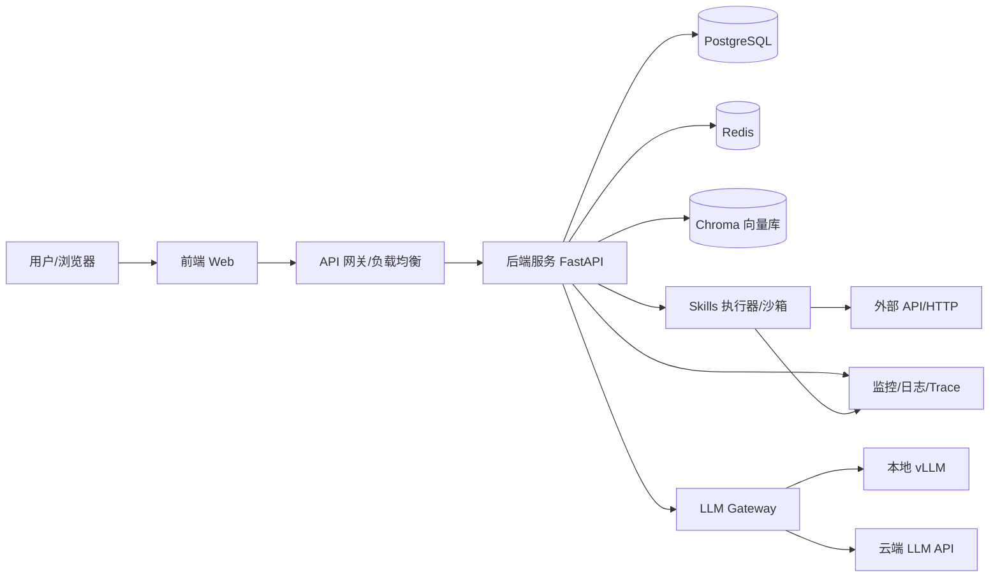
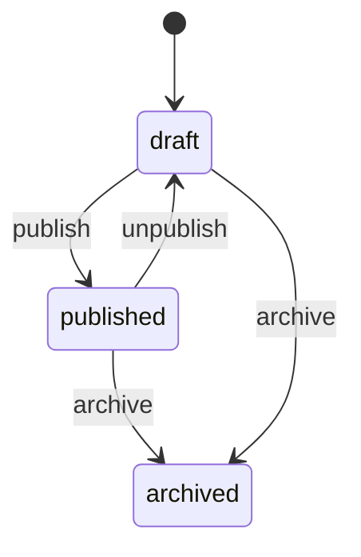

# 公司内部 Agent 平台 - 开发文档（研发交付版）

**文档版本：** V1.2  
**创建日期：** 2026-03-16  
**更新日期：** 2026-03-16  
**适用范围：** 技术研发交付（前端/后端/大模型应用/测试/运维）  
**来源依据：**《技术开发文档.md》  

---

## 1. 背景与范围
本项目旨在建设公司内部 Agent 平台，支持员工以低门槛创建与使用智能体，提升业务效率并保障企业级安全与可控。本文档面向研发落地，明确模块职责、API 规范、数据模型、安全与监控要求，并给出阶段性里程碑与人员分配建议。

**范围覆盖：**
- 智能体创建与市场、对话交互、权限管理、Skills 体系、外部 Skills 加载
- LLM/Agent 编排、RAG、记忆系统
- 安全、监控、审计、部署与运维

---

## 2. 目标与里程碑

### 2.1 目标
- 让业务人员可零代码创建/使用智能体
- 支撑企业级权限与审计
- 支撑 Skills 生态扩展，具备外部技能加载能力

### 2.2 分期策略（可调整）
- **MVP（8 周）**：核心功能可用
- **V1.0（12 周）**：完善流程与安全、可观测能力
- **V2.0（16 周）**：生态扩展、多模型路由、深度集成

**阶段标注说明：**
- `MVP` = 必须交付
- `V1.0` = 增强与稳定
- `V2.0` = 生态扩展与深度优化

---

## 3. 总体架构

**技术栈概览：**
- 前端：Vue 3 + TypeScript + Arco Design + Pinia + Vite
- 后端：FastAPI + SQLAlchemy + Pydantic + Redis + Celery
- AI/Agent：LangGraph + LangChain + vLLM + Qwen
- 数据：PostgreSQL + Chroma + Redis

**架构层次：**
- 表现层：前端应用（管理端 + 使用端）
- 服务层：用户、智能体、对话、Skills 管理、权限
- AI 层：Agent 编排、工具调用、RAG、记忆
- 技能层：内置/外部 Skills 加载与沙箱执行
- 数据层：关系型 + 向量 + 缓存
- 运维层：监控、日志、告警、成本分析

---

## 4. 功能模块与职责（技术组件划分）

### 4.1 前端模块

**4.1.1 登录与入口（MVP）**  
主要功能点：账号/SSO 登录入口、登录态校验、登出入口、会话过期提示。  
验收标准：支持账号/SSO 登录；未登录访问受保护页面自动跳转；登出后 Token 失效；登录失败有明确错误提示。

**4.1.2 智能体市场（MVP/V1.0）**  
主要功能点：列表展示、分类导航、搜索筛选（MVP）；推荐位与收藏夹（V1.0）。  
验收标准：MVP 支持分页、搜索条件生效；V1.0 推荐位可配置、收藏夹可增删。

**4.1.3 智能体详情与对话（MVP）**  
主要功能点：详情展示、对话入口、多轮对话、会话历史。  
验收标准：可进入详情并发起对话；多轮上下文连续；会话历史可回溯。

**4.1.4 智能体创建与配置（MVP/V1.0）**  
主要功能点：零代码创建向导、提示词编辑器、Skills 选择与配置（MVP）；知识库绑定、工作流编排、测试调试（V1.0）。  
验收标准：MVP 可在 5 分钟内创建并运行简单智能体；V1.0 支持拖拽编排与单步调试。

**4.1.5 权限与管理界面（MVP/V1.0）**  
主要功能点：用户管理、角色管理、资源授权（MVP）；审计日志查看（V1.0）。  
验收标准：用户/角色/授权可配置并生效；V1.0 可追踪授权审计记录。

**4.1.6 数据看板（V1.0/V2.0）**  
主要功能点：基础统计看板（V1.0）；高级分析看板（V2.0）。  
验收标准：V1.0 指标与后端统计一致；V2.0 支持按时间/部门/智能体维度分析。

---

### 4.2 后端应用模块

**4.2.1 认证与授权（MVP/V1.0）**  
主要功能点：JWT/OAuth2、RBAC/ABAC 校验、鉴权中间件。  
验收标准：MVP 未授权请求被拒绝；V1.0 资源级权限校验可覆盖智能体与 Skills。

**4.2.2 用户与组织（MVP）**  
主要功能点：用户 CRUD、批量导入、角色/部门映射。  
验收标准：支持批量导入；用户状态可用/禁用可控。

**4.2.3 智能体管理（MVP/V1.0）**  
主要功能点：智能体 CRUD、Prompt 模板管理、Skills 绑定配置（MVP）；发布/上下线（V1.0）。  
验收标准：MVP 创建后可正常对话；V1.0 发布状态影响市场可见性。

**4.2.4 对话与会话（MVP）**  
主要功能点：会话创建、多轮上下文管理、历史记录存储检索。  
验收标准：单会话不少于 10 轮；会话记录可追溯。

**4.2.5 Skills 管理（MVP/V1.0）**  
主要功能点：内置 Skills 元数据管理、分类/来源维护（MVP）；生命周期管理（V1.0）。  
验收标准：技能状态变更可即时生效；V1.0 支持禁用/卸载。

**4.2.6 数据统计与报表（V1.0/V2.0）**  
主要功能点：基础统计（V1.0）；高级分析指标（V2.0）。  
验收标准：统计结果与日志一致；支持导出。

---

### 4.3 AI/智能体模块

**4.3.1 Agent 编排（MVP）**  
主要功能点：LangGraph StateGraph、Agent 状态上下文管理。  
验收标准：多轮上下文稳定；任务状态可追踪。

**4.3.2 RAG 能力（V1.0）**  
主要功能点：查询重写、向量检索、重排、引用整合。  
验收标准：召回结果可溯源；召回准确率满足业务验收。

**4.3.3 记忆系统（MVP/V1.0）**  
主要功能点：短期记忆（MVP）、长期记忆与语义记忆（V1.0）。  
验收标准：短期上下文不丢失；V1.0 可基于用户画像提升回答一致性。

**4.3.4 多模型路由与成本优化（V2.0）**  
主要功能点：多模型路由策略、降级路径、成本优化。  
验收标准：路由策略可配置；成本较单一模型下降。

---

### 4.4 Skills 运行与生态模块

**4.4.1 Skill 规范解析（MVP）**  
主要功能点：`skill.yaml` 解析、输入/输出/执行配置校验。  
验收标准：不符合规范的 Skill 被拒绝加载。

**4.4.2 内置 Skills（MVP）**  
主要功能点：web_search、calculator、text_summary、translator、file_reader、current_time、weather_query。  
验收标准：各内置 Skill 可被调用且返回结构化结果。

**4.4.3 外部 Skills 加载（V1.0/V2.0）**  
主要功能点：GitHub/NPM/HTTP/本地上传（V1.0）；GitLab/私有仓库（V2.0）。  
验收标准：支持版本追踪与加载校验；非法来源拒绝。

**4.4.4 Skills 运行时（MVP/V1.0）**  
主要功能点：统一执行器（MVP）；依赖安装隔离、版本追踪（V1.0）。  
验收标准：执行失败可追踪；V1.0 支持依赖隔离与资源限制。

---

### 4.5 安全模块

**4.5.1 权限与审计（MVP/V1.0）**  
主要功能点：RBAC + ABAC、授权流程审计。  
验收标准：授权可溯源；V1.0 审计日志不可篡改。

**4.5.2 数据安全（MVP/V1.0）**  
主要功能点：TLS 1.3 传输加密（MVP）、AES-256 静态加密与脱敏（V1.0）。  
验收标准：敏感字段不可明文读取；传输链路强制 HTTPS。

**4.5.3 AI 安全（MVP/V1.0）**  
主要功能点：Prompt 注入防护、恶意输入过滤、幻觉校验与引用标注。  
验收标准：高风险输入被拒绝；引用结果可追踪。

**4.5.4 Skills 安全（MVP/V1.0）**  
主要功能点：AST 扫描、RestrictedPython 沙箱、白名单与资源限制。  
验收标准：危险模块被阻断；越权访问被拒绝；失败请求进入隔离流程。

---

### 4.6 数据存储模块

**4.6.1 关系型数据库（MVP/V1.0）**  
主要功能点：users/agents/skills/conversations 表（MVP）；skills 扩展字段（V1.0）。  
验收标准：表结构可迁移；索引命中率满足查询需求。

**4.6.2 缓存与短期记忆（MVP）**  
主要功能点：Redis 会话/上下文缓存。  
验收标准：缓存命中率>80%，缓存失效不影响核心功能。

**4.6.3 向量数据库（V1.0）**  
主要功能点：文档向量存储与检索。  
验收标准：向量检索延迟与召回满足 SLO。

---

### 4.7 任务与异步模块（V1.0）
主要功能点：Skills 加载/解析异步化、长耗时模型调用任务化。  
验收标准：异步任务可重试；失败任务可追踪。

---

### 4.8 监控与可观测性模块

**4.8.1 异常诊断（V1.0）**  
主要功能点：trace_id 贯穿全链路、失败请求自动归因。  
验收标准：任意请求可定位失败原因；链路日志完整。

**4.8.2 性能指标（MVP/V1.0/V2.0）**  
主要功能点：P95 延迟、错误率、成功率（MVP）；技能调用失败率、重试次数（V1.0）；多模型路由命中率（V2.0）。  
验收标准：指标可视化；告警规则生效。

**4.8.3 业务指标（V1.0）**  
主要功能点：智能体成功创建量、DAU、使用次数、收藏/推荐转化。  
验收标准：指标与业务日志一致；支持导出。

**4.8.4 成本指标（V1.0）**  
主要功能点：Token 调用量、单次成本、总成本波动。  
验收标准：成本波动异常触发告警。

---

### 4.9 部署与运维模块

**4.9.1 LLM 部署方案**  
主要功能点：混合部署优先（MVP），全本地（V2.0）。  
验收标准：MVP 支持本地与云 API 切换；V2.0 可全本地运行。

**4.9.2 资源与容量（MVP/V1.0/V2.0）**  
主要功能点：GPU 资源估算、扩容策略、降级路径。  
验收标准：满足并发指标与 P95 延迟约束。

---

## 5. API 规范与清单（接口级别）

### 5.1 通用规范
- Base URL：`/api/v1`
- 认证：`Authorization: Bearer <JWT>`
- 成功：`{code:0,message:"ok",data:{...}}`
- 失败：`{code:<int>,message:"...",detail:{...}}`
- 分页结构：`data: { list: [], total: 0, page: 1, page_size: 20 }`

**错误响应示例：**
```json
{
  "code": 4001,
  "message": "参数错误",
  "detail": {"field": "name", "reason": "required"}
}
```

### 5.1.1 通用参数校验规则
- 字符串：默认去首尾空格；空字符串视为无效值
- UUID：必须满足标准 UUID 格式
- 分页：`page` >= 1；`page_size` 范围 1-100，默认 20
- 时间区间：单次查询最大跨度 90 天（可配置）
- 关键字：`keyword` 长度 1-64
- 数组：单次提交长度默认不超过 200（按接口再约束）
- 布尔：仅接受 `true/false`
- 枚举：必须命中枚举值（未命中返回 4001）

### 5.2 错误码（示例）
| code | 含义 |
|---|---|
| 0 | 成功 |
| 4001 | 参数错误 |
| 4003 | 未认证 |
| 4004 | 无权限 |
| 4040 | 资源不存在 |
| 4090 | 冲突（重复/状态不允许） |
| 4290 | 请求过载/限流 |
| 5000 | 服务器内部错误 |
| 5001 | 模型调用失败 |
| 5002 | Skills 执行失败 |
| 5003 | Skills 加载失败 |
| 5004 | 请求超时 |

### 5.3 通用对象模型

**User**
| 字段 | 类型 | 说明 |
|---|---|---|
| id | string(UUID) | 用户 ID |
| username | string | 用户名 |
| email | string | 邮箱 |
| role | string | 角色标识 |
| status | string | active/disabled |
| created_at | string | 创建时间 |

**Role**
| 字段 | 类型 | 说明 |
|---|---|---|
| id | string(UUID) | 角色 ID |
| name | string | 角色名 |
| permissions | array | 权限列表 |

**Agent**
| 字段 | 类型 | 说明 |
|---|---|---|
| id | string(UUID) | 智能体 ID |
| name | string | 名称 |
| description | string | 描述 |
| owner_id | string(UUID) | 创建者 |
| prompt_template | string | Prompt 模板 |
| skills | array | Skills 配置 |
| is_public | boolean | 是否公开 |
| status | string | draft/published |

**Conversation**
| 字段 | 类型 | 说明 |
|---|---|---|
| id | string(UUID) | 会话 ID |
| agent_id | string(UUID) | 智能体 ID |
| user_id | string(UUID) | 用户 ID |
| messages | array | 消息列表 |
| created_at | string | 创建时间 |

**Skill**
| 字段 | 类型 | 说明 |
|---|---|---|
| id | string(UUID) | Skill ID |
| skill_id | string | 技能标识 |
| name | string | 名称 |
| category | string | built_in/api/system/custom/ai_powered |
| source_type | string | builtin/github/npm/http/local |
| version | string | 版本 |
| status | string | active/disabled |

### 5.3.1 核心对象字段校验规则（建议）

**User**
- `username`：3-32 字符，仅允许字母/数字/下划线
- `email`：符合邮箱格式
- `password`：8-32 字符，必须包含字母与数字
- `role`：`admin/user/manager`（可扩展）
- `status`：`active/disabled`

**Agent**
- `name`：1-50 字符
- `description`：0-200 字符
- `prompt_template`：1-4000 字符
- `skills`：最多 50 个；每项必须含 `skill_id`
- `status`：`draft/published/archived`

**Skill**
- `skill_id`：`^[a-z0-9_]{2,50}$`
- `category`：`built_in/api/system/custom/ai_powered`
- `source_type`：`builtin/github/npm/http/local/private_registry`
- `version`：遵循 semver（如 1.0.0）
- `status`：`active/disabled`

**Conversation**
- `messages`：每条消息内容长度 1-4000；单会话消息数默认不超过 200

### 5.3.2 枚举统一说明（研发对齐）
- `Skill.category` 统一使用：`built_in` / `api` / `system` / `custom` / `ai_powered`
- `Skill.source_type` 统一使用：`builtin` / `github` / `npm` / `http` / `local` / `private_registry`
- 若出现历史字段 `built-in` 或 `built_in` 混用，以 `built_in` 为准

---

### 5.4 接口明细

**POST /auth/login（MVP）**  
说明：账号登录  
权限：公开  
请求体：
| 字段 | 类型 | 必填 | 说明 |
|---|---|---|---|
| username | string | 是 | 用户名/邮箱 |
| password | string | 是 | 密码 |
| login_type | string | 否 | password/sso |
响应体：
| 字段 | 类型 | 说明 |
|---|---|---|
| access_token | string | JWT |
| expires_in | number | 过期秒数 |
| user | object | User |
错误码：4001,4003

请求示例：
```json
{
  "username": "alice",
  "password": "Passw0rd!",
  "login_type": "password"
}
```
响应示例：
```json
{
  "code": 0,
  "message": "ok",
  "data": {
    "access_token": "jwt.token.here",
    "expires_in": 3600,
    "user": {
      "id": "b1b1b1b1-1111-2222-3333-b1b1b1b1b1b1",
      "username": "alice",
      "email": "alice@example.com",
      "role": "admin",
      "status": "active",
      "created_at": "2026-03-16T08:00:00Z"
    }
  }
}
```

**POST /auth/logout（MVP）**  
说明：退出登录  
权限：登录用户  
请求体：无  
响应体：`{code:0,message:"ok"}`

响应示例：
```json
{
  "code": 0,
  "message": "ok",
  "data": {}
}
```

**GET /users（MVP）**  
说明：用户列表  
权限：管理员  
Query 参数：
| 字段 | 类型 | 必填 | 说明 |
|---|---|---|---|
| page | number | 否 | 页码 |
| page_size | number | 否 | 每页数量 |
| keyword | string | 否 | 关键词 |
响应体：分页结构，list 为 User 数组

响应示例：
```json
{
  "code": 0,
  "message": "ok",
  "data": {
    "list": [
      {"id": "u1", "username": "alice", "email": "alice@example.com", "role": "admin", "status": "active", "created_at": "2026-03-16T08:00:00Z"},
      {"id": "u2", "username": "bob", "email": "bob@example.com", "role": "user", "status": "active", "created_at": "2026-03-16T08:10:00Z"}
    ],
    "total": 2,
    "page": 1,
    "page_size": 20
  }
}
```

**POST /users（MVP）**  
说明：创建用户  
权限：管理员  
请求体：
| 字段 | 类型 | 必填 | 说明 |
|---|---|---|---|
| username | string | 是 | 用户名 |
| email | string | 是 | 邮箱 |
| password | string | 是 | 密码 |
| role | string | 是 | 角色 |
响应体：User

请求示例：
```json
{
  "username": "charlie",
  "email": "charlie@example.com",
  "password": "Passw0rd!",
  "role": "user"
}
```
响应示例：
```json
{
  "code": 0,
  "message": "ok",
  "data": {
    "id": "u3",
    "username": "charlie",
    "email": "charlie@example.com",
    "role": "user",
    "status": "active",
    "created_at": "2026-03-16T09:00:00Z"
  }
}
```

**PUT /users/{id}（MVP）**  
说明：更新用户  
权限：管理员  
请求体：与创建一致，字段可选

请求示例：
```json
{
  "role": "manager",
  "status": "active"
}
```
响应示例：
```json
{
  "code": 0,
  "message": "ok",
  "data": {"id": "u3", "role": "manager", "status": "active"}
}
```

**POST /users/import（MVP）**  
说明：批量导入用户  
权限：管理员  
请求体：
| 字段 | 类型 | 必填 | 说明 |
|---|---|---|---|
| users | array | 是 | User 创建对象列表 |
响应体：导入结果统计

请求示例：
```json
{
  "users": [
    {"username": "d1", "email": "d1@example.com", "password": "Passw0rd!", "role": "user"},
    {"username": "d2", "email": "d2@example.com", "password": "Passw0rd!", "role": "user"}
  ]
}
```
响应示例：
```json
{
  "code": 0,
  "message": "ok",
  "data": {"success": 2, "failed": 0}
}
```

**GET /roles（MVP）**  
说明：角色列表  
权限：管理员  
响应体：Role 数组

响应示例：
```json
{
  "code": 0,
  "message": "ok",
  "data": [
    {"id": "r1", "name": "admin", "permissions": ["agent:create", "agent:publish"]},
    {"id": "r2", "name": "user", "permissions": ["agent:use"]}
  ]
}
```

**POST /roles（MVP）**  
说明：创建角色  
权限：管理员  
请求体：
| 字段 | 类型 | 必填 | 说明 |
|---|---|---|---|
| name | string | 是 | 角色名 |
| permissions | array | 是 | 权限标识列表 |
响应体：Role

请求示例：
```json
{
  "name": "manager",
  "permissions": ["agent:create", "agent:publish", "skill:manage"]
}
```
响应示例：
```json
{
  "code": 0,
  "message": "ok",
  "data": {"id": "r3", "name": "manager", "permissions": ["agent:create", "agent:publish", "skill:manage"]}
}
```

**PUT /roles/{id}（MVP）**  
说明：更新角色  
权限：管理员  
请求体：与创建一致

请求示例：
```json
{
  "permissions": ["agent:create", "agent:publish", "agent:analytics"]
}
```
响应示例：
```json
{
  "code": 0,
  "message": "ok",
  "data": {"id": "r3", "name": "manager", "permissions": ["agent:create", "agent:publish", "agent:analytics"]}
}
```

**POST /permissions/grant（MVP）**  
说明：授权  
权限：管理员  
请求体：
| 字段 | 类型 | 必填 | 说明 |
|---|---|---|---|
| subject_type | string | 是 | user/role/team |
| subject_id | string | 是 | 主体 ID |
| object_type | string | 是 | agent/skill/data |
| object_id | string | 是 | 资源 ID |
| actions | array | 是 | read/write/execute |
响应体：授权结果

请求示例：
```json
{
  "subject_type": "user",
  "subject_id": "u3",
  "object_type": "agent",
  "object_id": "a1",
  "actions": ["read", "execute"]
}
```
响应示例：
```json
{
  "code": 0,
  "message": "ok",
  "data": {"granted": true}
}
```

**GET /agents（MVP）**  
说明：智能体列表  
权限：登录用户  
Query 参数：
| 字段 | 类型 | 必填 | 说明 |
|---|---|---|---|
| page | number | 否 | 页码 |
| page_size | number | 否 | 每页数量 |
| keyword | string | 否 | 关键词 |
| is_public | boolean | 否 | 是否公开 |
响应体：分页结构，list 为 Agent 数组

响应示例：
```json
{
  "code": 0,
  "message": "ok",
  "data": {
    "list": [
      {"id": "a1", "name": "日报助手", "description": "生成日报", "owner_id": "u1", "prompt_template": "...", "skills": [], "is_public": true, "status": "published"}
    ],
    "total": 1,
    "page": 1,
    "page_size": 20
  }
}
```

**POST /agents（MVP）**  
说明：创建智能体  
权限：有创建权限用户  
请求体：
| 字段 | 类型 | 必填 | 说明 |
|---|---|---|---|
| name | string | 是 | 名称 |
| description | string | 否 | 描述 |
| prompt_template | string | 是 | Prompt 模板 |
| skills | array | 否 | Skills 配置 |
| is_public | boolean | 否 | 是否公开 |
响应体：Agent

请求示例：
```json
{
  "name": "日报助手",
  "description": "生成日报",
  "prompt_template": "你是一个日报助手...",
  "skills": [{"skill_id": "text_summary"}],
  "is_public": true
}
```
响应示例：
```json
{
  "code": 0,
  "message": "ok",
  "data": {"id": "a1", "name": "日报助手", "status": "draft", "is_public": true}
}
```

**GET /agents/{id}（MVP）**  
说明：智能体详情  
权限：登录用户  
响应体：Agent

响应示例：
```json
{
  "code": 0,
  "message": "ok",
  "data": {"id": "a1", "name": "日报助手", "description": "生成日报", "owner_id": "u1", "prompt_template": "...", "skills": [], "is_public": true, "status": "published"}
}
```

**PUT /agents/{id}（MVP）**  
说明：更新智能体  
权限：创建者或管理员  
请求体：与创建一致，字段可选

请求示例：
```json
{
  "description": "生成标准化日报",
  "is_public": false
}
```
响应示例：
```json
{
  "code": 0,
  "message": "ok",
  "data": {"id": "a1", "description": "生成标准化日报", "is_public": false}
}
```

**POST /agents/{id}/publish（V1.0）**  
说明：发布智能体  
权限：创建者或管理员  
请求体：无

响应示例：
```json
{
  "code": 0,
  "message": "ok",
  "data": {"id": "a1", "status": "published"}
}
```

**POST /agents/{id}/unpublish（V1.0）**  
说明：下架智能体  
权限：创建者或管理员  
请求体：无

响应示例：
```json
{
  "code": 0,
  "message": "ok",
  "data": {"id": "a1", "status": "draft"}
}
```

**POST /conversations（MVP）**  
说明：创建会话  
权限：登录用户  
请求体：
| 字段 | 类型 | 必填 | 说明 |
|---|---|---|---|
| agent_id | string | 是 | 智能体 ID |
响应体：Conversation

请求示例：
```json
{
  "agent_id": "a1"
}
```
响应示例：
```json
{
  "code": 0,
  "message": "ok",
  "data": {"id": "c1", "agent_id": "a1", "user_id": "u1", "messages": [], "created_at": "2026-03-16T10:00:00Z"}
}
```

**GET /conversations/{id}（MVP）**  
说明：获取会话  
权限：会话所属用户  
响应体：Conversation

响应示例：
```json
{
  "code": 0,
  "message": "ok",
  "data": {
    "id": "c1",
    "agent_id": "a1",
    "user_id": "u1",
    "messages": [
      {"role": "user", "content": "帮我生成日报"},
      {"role": "assistant", "content": "好的，请提供今日工作要点"}
    ],
    "created_at": "2026-03-16T10:00:00Z"
  }
}
```

**POST /conversations/{id}/messages（MVP）**  
说明：发送消息  
权限：会话所属用户  
请求体：
| 字段 | 类型 | 必填 | 说明 |
|---|---|---|---|
| content | string | 是 | 用户输入 |
| attachments | array | 否 | 附件 |
响应体：
| 字段 | 类型 | 说明 |
|---|---|---|
| assistant_message | string | 助手回复 |
| trace_id | string | 链路 ID |

请求示例：
```json
{
  "content": "今天完成了接口联调",
  "attachments": []
}
```
响应示例：
```json
{
  "code": 0,
  "message": "ok",
  "data": {
    "assistant_message": "已为你整理日报摘要...",
    "trace_id": "t-123456"
  }
}
```

**GET /skills（MVP）**  
说明：技能列表  
权限：登录用户  
Query 参数：category/source_type/status

响应示例：
```json
{
  "code": 0,
  "message": "ok",
  "data": {
    "list": [
      {"id": "s1", "skill_id": "text_summary", "name": "文本摘要", "category": "ai_powered", "source_type": "builtin", "version": "1.0.0", "status": "active"}
    ],
    "total": 1,
    "page": 1,
    "page_size": 20
  }
}
```

**POST /skills（MVP）**  
说明：注册内置 Skill  
权限：管理员  
请求体：
| 字段 | 类型 | 必填 | 说明 |
|---|---|---|---|
| skill_id | string | 是 | 技能标识 |
| name | string | 是 | 名称 |
| category | string | 是 | 技能分类 |
| version | string | 是 | 版本 |
| yaml_definition | object | 是 | skill.yaml 内容 |

请求示例：
```json
{
  "skill_id": "calculator",
  "name": "计算器",
  "category": "built_in",
  "version": "1.0.0",
  "yaml_definition": {"skill_id": "calculator", "name": "计算器"}
}
```
响应示例：
```json
{
  "code": 0,
  "message": "ok",
  "data": {"id": "s2", "skill_id": "calculator", "status": "active"}
}
```

**POST /skills/load（V1.0）**  
说明：加载外部 Skill  
权限：管理员  
请求体：
| 字段 | 类型 | 必填 | 说明 |
|---|---|---|---|
| source_type | string | 是 | github/npm/http/local/private_registry |
| source_url | string | 否 | 来源地址 |
| source_version | string | 否 | 版本/分支 |
| package_path | string | 否 | 本地包路径 |

请求示例：
```json
{
  "source_type": "github",
  "source_url": "https://github.com/org/skill-repo",
  "source_version": "v1.0.0"
}
```
响应示例：
```json
{
  "code": 0,
  "message": "ok",
  "data": {"installed": true, "skill_id": "web_search_pro"}
}
```

**POST /skills/{id}/disable（V1.0）**  
说明：禁用 Skill  
权限：管理员  
请求体：
| 字段 | 类型 | 必填 | 说明 |
|---|---|---|---|
| reason | string | 否 | 禁用原因 |

请求示例：
```json
{
  "reason": "存在高危依赖"
}
```
响应示例：
```json
{
  "code": 0,
  "message": "ok",
  "data": {"id": "s2", "status": "disabled"}
}
```

**GET /metrics/summary（V1.0）**  
说明：关键指标汇总  
权限：管理员  
响应体：性能/业务/成本摘要

响应示例：
```json
{
  "code": 0,
  "message": "ok",
  "data": {
    "p95_ms": 4200,
    "success_rate": 0.992,
    "token_day": 1200000,
    "agent_created_day": 34
  }
}
```

**GET /metrics/errors（V1.0）**  
说明：异常分析  
权限：管理员  
响应体：错误分布与 TopN

响应示例：
```json
{
  "code": 0,
  "message": "ok",
  "data": {
    "top_errors": [
      {"code": 5002, "count": 32},
      {"code": 5001, "count": 12}
    ]
  }
}
```

**GET /metrics/tokens（V1.0）**  
说明：Token 调用统计  
权限：管理员  
响应体：时间序列

响应示例：
```json
{
  "code": 0,
  "message": "ok",
  "data": [
    {"date": "2026-03-15", "tokens": 980000, "cost": 320.5},
    {"date": "2026-03-16", "tokens": 1200000, "cost": 398.2}
  ]
}
```

**GET /metrics/agents（V1.0）**  
说明：智能体创建/使用统计  
权限：管理员  
响应体：创建量、使用量、留存

响应示例：
```json
{
  "code": 0,
  "message": "ok",
  "data": {
    "created": 34,
    "used": 120,
    "retention_7d": 0.42
  }
}
```

### 5.4.1 重点接口请求校验规则

- `POST /auth/login`
  - `username`：3-64 字符
  - `password`：8-32 字符
  - `login_type`：`password/sso`

- `POST /agents`
  - `name`：1-50 字符（必填）
  - `prompt_template`：1-4000 字符（必填）
  - `skills`：最多 50 个

- `POST /conversations/{id}/messages`
  - `content`：1-4000 字符（必填）
  - `attachments`：最多 10 个；单附件大小 <= 10MB（V1.0）

- `POST /skills/load`
  - `source_type`：`github/npm/http/local/private_registry`
  - `source_url`：当 `source_type` 为 github/npm/http 时必填
  - `package_path`：当 `source_type` 为 local 时必填

---

## 6. 数据模型与表结构

### 6.1 users
字段：id(UUID), username, email, password_hash, role, status, created_at, updated_at  
索引：username 唯一索引，email 唯一索引

### 6.2 agents
字段：id(UUID), name, description, owner_id, prompt_template, skills(JSONB), is_public, status, created_at, updated_at  
索引：owner_id 索引

### 6.3 skills
字段：id(UUID), skill_id, name, description, version, category, author, yaml_definition, inputs_schema, outputs_schema, execution_config, source_type, source_url, source_version, checksum, installed_at, dependency_lock, status  
索引：category、source_type、status

### 6.4 conversations
字段：id(UUID), agent_id, user_id, messages(JSONB), created_at  
索引：user_id、agent_id

### 6.5 request_logs（V1.0 推荐）
字段：id(UUID), method, path, status_code, latency_ms, trace_id, user_id, created_at  
用途：性能指标与 P95 计算、错误码分布统计  

### 6.6 llm_usage（V1.0 推荐）
字段：id(UUID), user_id, agent_id, model, prompt_tokens, completion_tokens, total_tokens, cost, latency_ms, trace_id, created_at  
用途：Token 统计、成本分析、模型调用成功率  

### 6.7 skill_invocations（V1.0 推荐）
字段：id(UUID), skill_id, user_id, agent_id, status, latency_ms, error_code, trace_id, created_at  
用途：技能调用成功率、失败原因分析  

### 6.8 event_logs（V1.0 推荐）
字段：id(UUID), event_type, user_id, agent_id, metadata(JSONB), created_at  
用途：业务指标（DAU、推荐转化、使用行为）  

---

## 7. 安全设计
- 认证：JWT + OAuth2
- 权限：RBAC + ABAC
- 数据加密：TLS 1.3 + AES-256
- AI 安全：Prompt 注入防护、恶意输入过滤、引用标注
- Skills 安全：AST 扫描、RestrictedPython 沙箱、白名单、资源限制

---

## 8. 监控与可观测性

**异常诊断流程：**  追踪 trace_id → 聚合错误类型 → 定位责任组件 → 回溯日志与请求上下文。

**指标体系（示例）：**
| 类型 | 指标 | 说明 | 阶段 |
|---|---|---|---|
| 性能 | P95 延迟 | 请求响应 P95 | MVP |
| 性能 | 成功率 | 请求成功率 | MVP |
| 稳定性 | 技能调用失败率 | Skills 调用失败占比 | V1.0 |
| 成本 | Token 调用量 | 按日/周/月统计 | V1.0 |
| 业务 | 智能体成功创建量 | 创建成功计数 | V1.0 |
| 业务 | 智能体日活 | DAU | V1.0 |
| 业务 | 推荐转化率 | 推荐点击/使用 | V1.0 |
| 性能 | 多模型路由命中率 | 路由效果 | V2.0 |

### 8.1 指标口径定义（示例）
- **成功率** = 成功请求数 / 总请求数
- **错误率** = 5xx 请求数 / 总请求数
- **P95 延迟** = 请求延迟的 95 分位
- **技能调用失败率** = 失败调用数 / 技能调用总数
- **Token 调用量** = `llm_usage.total_tokens` 按时间窗口聚合
- **智能体成功创建量** = `agents` 表新增记录数（排除删除/失败）
- **DAU** = `event_logs` 中 `event_type='agent_use'` 的去重用户数
- **推荐转化率** = 推荐点击次数 / 推荐曝光次数（来自 event_logs）

### 8.2 告警阈值建议
| 指标 | 阈值 | 窗口 | 等级 | 处理建议 |
|---|---|---|---|---|
| P95 延迟 | > 6s | 5 分钟 | 严重 | 降级外部 Skills / 启用缓存 |
| 请求错误率 | > 2% | 5 分钟 | 高 | 排查错误码 TopN |
| 技能调用失败率 | > 3% | 10 分钟 | 高 | 禁用异常技能 |
| 模型调用失败率 | > 5% | 10 分钟 | 高 | 切换备援模型 |
| Token 成本增长 | 环比 > 2 倍 | 1 小时 | 中 | 限流/成本策略触发 |
| 智能体创建失败率 | > 5% | 30 分钟 | 中 | 检查权限与依赖 |

### 8.3 仪表盘布局草案
- **总览**：全链路成功率、P95 延迟、DAU、Token 成本
- **性能**：P50/P95/P99 延迟、吞吐、错误码分布
- **业务**：智能体创建量、使用量、收藏/推荐转化、留存
- **成本**：Token 日/周/月、单次调用成本、Top N 高成本智能体
- **Skills**：调用量、失败率、Top N 异常技能
- **LLM**：模型调用成功率、耗时、路由命中率
- **异常分析**：TopN 错误类型、trace_id 跟踪入口

### 8.4 SQL 示例

**Token 调用量（日）**
```sql
SELECT date_trunc('day', created_at) AS d,
       sum(total_tokens) AS tokens,
       sum(cost) AS cost
FROM llm_usage
GROUP BY 1
ORDER BY 1;
```

**智能体成功创建量（日）**
```sql
SELECT date_trunc('day', created_at) AS d,
       count(*) AS created_agents
FROM agents
WHERE status IN ('draft','published')
GROUP BY 1
ORDER BY 1;
```

**DAU（日）**
```sql
SELECT date_trunc('day', created_at) AS d,
       count(DISTINCT user_id) AS dau
FROM event_logs
WHERE event_type = 'agent_use'
GROUP BY 1
ORDER BY 1;
```

**技能调用失败率（日）**
```sql
SELECT date_trunc('day', created_at) AS d,
       sum(CASE WHEN status = 'failed' THEN 1 ELSE 0 END)::float / count(*) AS fail_rate
FROM skill_invocations
GROUP BY 1
ORDER BY 1;
```

**P95 延迟（小时）**
```sql
SELECT date_trunc('hour', created_at) AS h,
       percentile_cont(0.95) WITHIN GROUP (ORDER BY latency_ms) AS p95_ms
FROM request_logs
GROUP BY 1
ORDER BY 1;
```

### 8.5 PromQL 示例（以推荐指标命名为例）
- **请求成功率**
```
1 - (sum(rate(http_requests_total{status=~"5.."}[5m])) / sum(rate(http_requests_total[5m])))
```

- **P95 延迟**
```
histogram_quantile(0.95, sum(rate(http_request_duration_seconds_bucket[5m])) by (le))
```

- **技能调用失败率**
```
sum(rate(skill_invocations_total{status="failed"}[5m])) / sum(rate(skill_invocations_total[5m]))
```

- **Token 调用量（每分钟）**
```
sum(rate(llm_tokens_total[1m]))
```

---

## 9. 部署与运维

### 9.1 部署拓扑（示意）


### 9.2 环境要求
- 操作系统：Linux/Windows Server
- Python 3.11+
- Node.js 18+
- PostgreSQL 15+
- Redis 7+
- GPU（MVP 最少 1 卡，V2.0 4 卡）

### 9.3 环境变量清单（示例）

**后端服务**
| 变量 | 说明 |
|---|---|
| APP_ENV | 运行环境 dev/prod |
| APP_HOST | 监听地址 |
| APP_PORT | 监听端口 |
| DB_URL | PostgreSQL 连接串 |
| REDIS_URL | Redis 连接串 |
| CHROMA_URL | Chroma 服务地址 |
| JWT_SECRET | JWT 密钥 |
| JWT_EXPIRE_MIN | Token 过期分钟 |
| LLM_GATEWAY_URL | LLM 网关地址 |
| LLM_MODEL | 默认模型名 |
| SKILL_SANDBOX_MODE | sand/isolated |
| LOG_LEVEL | 日志级别 |
| OTEL_EXPORTER_OTLP_ENDPOINT | Trace 上报地址 |

**前端应用**
| 变量 | 说明 |
|---|---|
| VITE_API_BASE | API 基地址 |
| VITE_SSO_URL | SSO 地址 |
| VITE_APP_NAME | 应用名 |
| VITE_ENV | 环境标识 |

**LLM 服务**
| 变量 | 说明 |
|---|---|
| VLLM_HOST | vLLM 地址 |
| VLLM_PORT | vLLM 端口 |
| MODEL_PATH | 模型路径 |
| GPU_COUNT | GPU 数量 |

**异步任务**
| 变量 | 说明 |
|---|---|
| CELERY_BROKER_URL | Broker 地址 |
| CELERY_RESULT_BACKEND | 结果存储 |

---

## 10. 测试策略
- 单元测试：核心服务、Skills 执行器
- 集成测试：对话链路与权限校验
- 压测：P95 延迟与并发
- 安全测试：权限绕过、输入攻击

---

## 11. 人员分配与协作边界

**团队配置**
- 后端：2-3
- 前端：2
- AI/LLM 应用：1-2
- 产品：1
- 测试：1

**责任边界建议：**
- 前端：用户端 UI、智能体市场与创建页面
- 后端：API、权限、数据模型、Skills 管理
- AI：Agent 编排、RAG、模型路由
- 测试：自动化测试与性能压测

---

## 12. 风险与应对
- LLM API 不稳定 → 多模型备援、降级策略
- Skills 安全风险 → 沙箱 + 审计 + 白名单
- 性能瓶颈 → 压测与弹性扩容

---

## 13. 研发交付增补章节（开发人员必读）

### 13.1 业务流程与状态流转（必交付）
**智能体状态机（示意）**


**关键流程约束**
- 仅 `owner` 或 `admin` 可 `publish/unpublish/archive`
- `published` 状态仅允许更新 `description` 与 `is_public`，其余字段需先 `unpublish`
- `archived` 不可恢复为 `published`，仅可复制新建

### 13.2 权限模型细则（必交付）
**资源层级**
- 组织（org） → 部门（dept） → 用户（user）
- 资源（agent/skill/data）按 `org/dept/owner` 三层归属

**默认权限**
- `admin`：全资源管理
- `manager`：本部门资源管理
- `user`：自建资源管理 + 公开资源使用

**权限校验顺序**
1. RBAC 角色权限
2. ABAC 属性条件（所属部门、资源归属、资源状态）
3. 资源级 ACL（显式授权）

**授权与回收流程**
- 授权记录必须入 `event_logs`，字段包含 `subject_type/subject_id/object_type/object_id/actions`
- 回收权限后，需立即生效且会话内更新（不延迟）

### 13.3 API 约定细化（必交付）
**通用约定**
- 统一时间格式：`ISO8601`，使用 `UTC`，例 `2026-03-16T08:00:00Z`
- 列表类接口支持 `sort_by` 与 `order`，默认 `created_at desc`
- 过滤统一使用 `field=value` 与 `field__op=value`（如 `status=active`，`created_at__gte=...`）
- `X-Request-Id`：网关生成并下传，后端透传到日志与响应头

**幂等策略**
- 所有创建类 `POST` 支持 `Idempotency-Key` 请求头
- 服务端需记录 `Idempotency-Key` 与请求体哈希，命中时直接返回历史响应

**分页与限制**
- `page/page_size` 仍保留
- `page_size` 上限 100，超限返回 `4001`
- `keyword` 支持模糊匹配时必须指定 `search_fields`

**错误响应扩展**
- `detail` 统一含 `field`、`reason`、`trace_id`
- `trace_id` 必须在所有 4xx/5xx 中返回

**版本兼容**
- `/api/v1` 为稳定版本
- 破坏性变更需在 `/api/v2` 引入，旧版保留至少 90 天

**限流策略**
- 默认：`60 req/min`（用户维度）
- `POST /conversations/{id}/messages`：`20 req/min`
- 超限返回 `4290`，响应头包含 `Retry-After`

### 13.4 认证与会话（必交付）
**Token 策略**
- Access Token：短期（默认 60 分钟）
- Refresh Token：长期（默认 14 天）
- 支持强制失效与单点登出

**新增接口**
- `POST /auth/refresh`：刷新 Access Token
- `POST /auth/revoke`：吊销 Refresh Token
- `GET /auth/me`：获取当前用户与权限摘要

**SSO/OAuth2 流程**
- 前端跳转 SSO 登录
- SSO 回调后换取 `access_token/refresh_token`
- 失败需返回明确错误码与用户可读提示

### 13.5 RAG 与记忆生命周期（必交付）
**知识库入库流程**
1. 上传文档 → 格式校验 → 分块（chunk）→ 向量化 → 入库
2. 为每个文档生成 `doc_id` 与 `version`
3. 记录索引状态：`pending/indexed/failed`

**更新与删除**
- 文档更新必须产生新 `version` 并保留旧版本 7 天可回滚
- 删除文档需同步删除向量索引与元数据

**索引重建**
- 支持按知识库触发重建
- 重建期间查询走旧索引，完成后原子切换

**记忆保留**
- 短期记忆：会话级缓存，TTL 默认 24 小时
- 长期记忆：用户级画像，默认保留 180 天，可配置

### 13.6 Skills 运行隔离与资源限制（必交付）
**沙箱策略**
- 运行方式：独立进程或容器
- 禁止出网或仅允许白名单域名
- 文件系统只读，且仅允许读取挂载的工作目录

**资源限制（默认）**
- CPU：1 core
- Memory：512MB
- Timeout：10s（可按技能覆盖）
- 并发：单技能实例 `max_concurrency=5`

**依赖隔离**
- 每个 Skill 使用独立依赖锁文件
- 依赖缓存按 `skill_id+version` 复用

**安全策略**
- 执行前：AST 扫描 + 敏感库黑名单
- 执行中：系统调用与文件访问拦截
- 执行后：生成审计日志

### 13.7 非功能指标与 SLO（必交付）
- 可用性：MVP `99.5%`，V1.0 `99.9%`
- P95：MVP `< 6s`，V1.0 `< 4s`
- 失败率：`< 1%`
- 关键链路：对话请求、技能执行、RAG 检索

### 13.8 运维交付规范（建议）
**环境分层**
- `dev`、`staging`、`prod` 三套环境
- `staging` 与 `prod` 使用相同规模配置

**CI/CD**
- 合并前必须通过单测与核心集成测试
- 数据库迁移使用版本化脚本并支持回滚

**灰度与回滚**
- 新版本按 `5% -> 20% -> 100%` 流量灰度
- 支持一键回滚到上一个稳定版本

**备份与灾备**
- PostgreSQL 日备份 + 7 天保留
- Redis 关键数据持久化

### 13.9 监控落地规范（建议）
**日志字段标准**
- `trace_id`、`user_id`、`agent_id`、`skill_id`、`latency_ms`、`status_code`

**Trace 关键跨度**
- API 网关 → 后端服务 → Skills 执行器 → LLM 调用

**指标口径对齐**
- `success_rate` 与 `request_logs` 的 `status_code` 一致
- `token_day` 与 `llm_usage.total_tokens` 聚合一致

### 13.10 测试与验收细化（建议）
**测试覆盖**
- 单元测试：核心服务与权限中间件
- 集成测试：对话链路、技能调用、RAG 检索
- 压测：并发 100/500/1000 的响应曲线

**验收样例**
- 用户创建智能体 ≤ 5 分钟
- 连续对话 10 轮无上下文丢失
- Skills 执行失败率 < 3%

### 13.11 风险与外部依赖（建议）
- 依赖服务：LLM API、向量库、SSO 平台
- 风险项：外部服务波动、成本不可控、技能执行安全
- 缓解：多模型备援、成本阈值策略、技能白名单

**文档结束**
